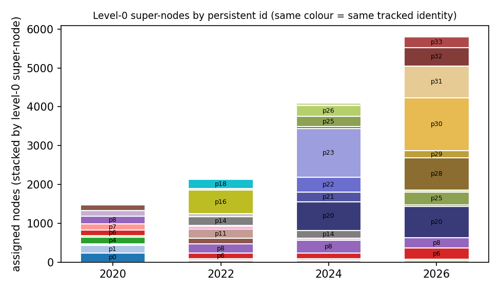
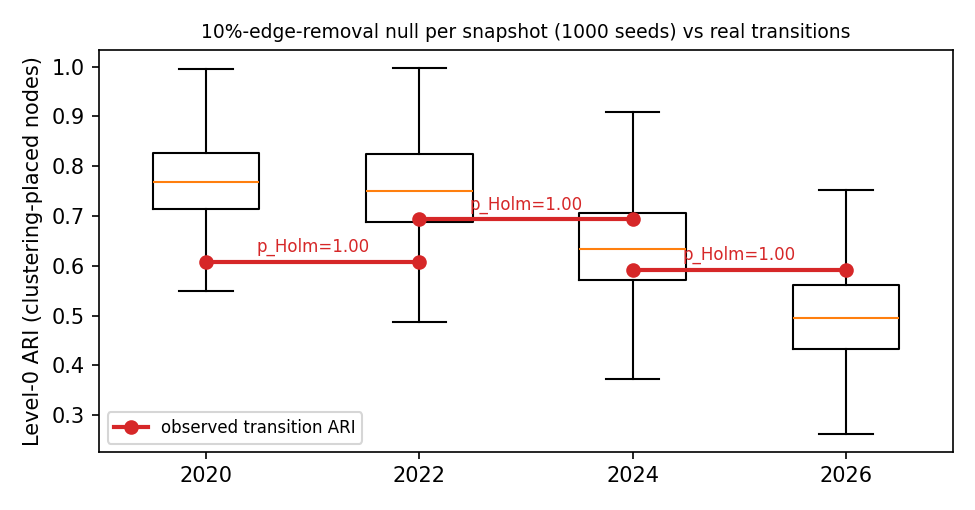

# Multi-Resolution Semantic Abstraction over an Evolving Knowledge Hypergraph

All numbers in this report are produced by the scripts named next to them and
are stored in `outputs/metrics.json`. The chronological log of every review
round, bug and correction (including sections that code docstrings still cite
by name, e.g. "Fourth review round") is kept in
`docs/report_review_history.md`; this document is the current, consolidated
account.

## 1. Data and snapshots (T1)

Option A export: 52 articles, 5,798 nodes, 1,429 hyperedges, 11 relation
types. A node enters snapshot *t* when `eff_first_seen = min(first_seen_year,
earliest incident edge's article_year) ≤ t`; an edge enters when its
`article_year ≤ t` (never the real-world invention year, which would leak the
future). `src/load_graph.py` → `outputs/t1_snapshot_stats.json`.

| cutoff | nodes | hyperedges | mean / max arity | clustering edges *m* | super-nodes L0/L1/L2/L3 |
|---|---|---|---|---|---|
| 2020 | 1,505 | 374 | 5.57 / 45 | 102 | 11 / 23 / 49 / 102 |
| 2022 | 2,171 | 554 | 5.68 / 59 | 144 | 15 / 32 / 68 / 144 |
| 2024 | 4,164 | 983 | 6.19 / 65 | 242 | 15 / 38 / 96 / 242 |
| 2026 | 5,798 | 1,429 | 6.25 / 65 | 334 | 14 / 40 / 116 / 334 |

Growth between snapshots is real and uneven: +44% / +92% / +39% nodes and
+48% / +77% / +45% edges. Data-quality issues found and handled: 17 nodes whose
`first_seen_year` is later than an edge that mentions them (fixed by
`eff_first_seen`); 301 `evaluated_on` rows from only 36 articles (merged into
one hyperedge per article, otherwise one paper's results table dominates);
`claims` is 48% of all edges at near-minimal arity; 87.8% of nodes have degree
1; only 831/5,798 nodes have a true `origin_year`.

## 2. Deliverable 0 — formal statement

**Input.** Snapshot *H(t) = (V, E)*. Clustering edges *E′ ⊂ E* exclude
`claims` (volume, near-degenerate), `authored_by` (identity, not topic),
`presents` (arity-2, overlaps nothing) and hold out `cites` entirely (the
coherence probe). *m = |E′|*; each *e* has member set *M(e)*.

**Similarity between hyperedges.**
*s_struct(i,j) = Σ_{v∈M_i∩M_j} w(v) / Σ_{v∈M_i∪M_j} w(v)*, with
*w(v) = log(1 + #articles mentioning v)*, which down-weights a paper's own hub
node (the main source of "cluster = paper" bias).
*s_sem(i,j)* = cosine of all-MiniLM-L6-v2 embeddings of each edge's
concatenated member surface forms. Both are rank-normalised over the upper
triangle, *r(·) ∈ (0,1]*, and combined arithmetically:
*d(i,j) = 1 − [α·r(s_struct) + (1−α)·r(s_sem)]*, *α = 0.5*.

**Criterion.** Complete-linkage HAC on *d* gives a dendrogram; level *k* is the
cut at height *τ_k*. Level 0: a height *τ_0*, found by bisection, whose
cut yields *k_0 ∈ [10, 15]*. Levels 1..K−1: cluster counts spaced geometrically between
*k_0* and *m*; level K: one hyperedge per cluster. Because complete linkage
merges at the maximum pairwise distance, **every level-k super-node satisfies
diam(C) = max_{i,j∈C} d(i,j) ≤ τ_k** — the method greedily minimises cluster
diameter subject to the P2 count, rather than optimising a global objective.
Nodes are then read out top-down:
*π_0(v) = argmax_c |{e∋v : Q_0(e)=c}|*, and
*π_k(v) = argmax_c |{e∋v : Q_{k−1}(e)=π_{k−1}(v), Q_k(e)=c}|*.
Nodes with no clustering edge are placed afterwards with the same restricted
majority rule over neighbours in `presents` (articles inherit the presented
method's path), then `claims`, `authored_by`, and `cites` as a last resort;
every node carries a `provenance` tag so the coherence probe can exclude
`cites`-placed nodes. Nodes with no incident edge at *t* (30/27/70/0) stay
unassigned; P1/P2 are stated over assigned nodes.

**Structure/semantics trade-off.** Structure alone is unusable here: only
4.7–7.7% of edge pairs share any member (92–95% of *s_struct* is exactly 0),
and α = 1 collapses level 0 to one cluster (earlier round). Semantics alone
ignores which entities actually co-occur. We chose an explicit, auditable
arithmetic mix of rank-normalised signals: a geometric mean was rejected
because any zero structural factor would delete the semantic term; raw-scale
mixing was rejected because *s_sem* has ~20× the variance and α = 0.5 was in
effect 95% semantic. Even after rank normalisation, structure supplies only
12–18% of the combined variance (see §8) — an honest, data-driven limit.

**Complexity.** *O(m²·ā)* for similarities (*ā* mean arity), *O(m²)* memory
and at most *O(m² log m)* for HAC; node read-out *O(Σ deg)*. At *m = 334*:
55,611 pairs, ~1 s per snapshot; the 4,000-run T3 null takes ~4 min. Beyond
~10⁵ edges this needs approximate neighbours (out of scope).

**Guaranteed vs. empirical.**

| | Status | Evidence |
|---|---|---|
| P1 laminar | **By construction** (nested cuts + parent-restricted read-out) | node-level check PASS on all snapshots and under 80 random edge-order permutations |
| P2 budget | **By construction at L0** when a 10–15 cut exists (search, asserted) | 11/15/15/14; held in all 4,000 perturbed re-clusterings |
| P3 coherence | Both signals always present; quality **empirical** | coherence probe null (§6) |
| P4 fidelity | **By construction**: units are hyperedges, T4 keeps coarse hyperedges | no node projection is built for clustering |
| P5 stability | **Empirical, not achieved beyond noise** | §5 |
| P6 labels | L0/L1 **empirical** (0/188 entity over-claims); L2/L3 templates cannot over-claim by construction | §6 |

**Alternatives rejected.** (i) Keeping the overlapping communities of
hyperedge clustering (Lotito et al.; DeWolfe & Théberge) — violates P1.
(ii) A learned joint representation (CAHC-style contrastive) — too little data
(102–334 edges) and not hand-verifiable. (iii) Temporal regularisation of the
distance toward the previous snapshot — it raised transition ARI *by
construction* (the metric measured the regulariser), so λ = 0 was kept.
(iv) Average linkage (chained into two clusters holding 75% of nodes) and Ward
(invalid for non-Euclidean *d*).

## 3. Literature positioning

We build on hyperedge (link) clustering (Lotito et al., 2023; DeWolfe &
Théberge, 2025): clustering the hyperedges themselves is hypergraph-native and
yields a dendrogram, i.e. multiple resolutions for free. We depart from them by
(a) hard, laminar node assignment instead of overlap, (b) an explicit P2 cut
search, (c) adding a semantic term, and (d) replacing a continuous time kernel
by discrete snapshots plus post-hoc identity matching. From HyperSF (Aghdaei
et al., 2021) we take the principle that coarsening must not clique-expand
hyperedges, but we preserve multiplicities rather than spectral properties.
CAHC (Ni et al., 2026) motivates reconciling structure and attributes, which
we do with an explicit α rather than a learned embedding. Dreveton et al.
(2026) frame bottom-up vs. top-down hierarchy construction; ours is bottom-up
agglomeration with a top-down read-out. TSA-HGNN (Vusirikkayala & Viswanatham,
2026) adds stability objectives to dynamic community detection; our analogue
(λ-regularisation) was tested and rejected for the circularity reason above.

## 4. Hyper-edge collapse (T4)

Implemented in `src/hyperedge_collapse.py` and run on every level of every
snapshot (16 outputs), over **all** hyperedges including `claims`/`cites`.
For edge *e* with endpoints spread over super-node set *σ(e)*:
*m = n* (|σ| = 1) → internal edge, kept and counted in the super-node's
cohesion (internal / incident mass); *1 < m < n*, |σ| = 2 → coarse edge of
weight 1 with its multiplicity vector; |σ| ≥ 3 → a **coarse hyperedge of arity
|σ|** with weight 1/(|σ|−1) and multiplicities, never clique-expanded.
Cohesion scores feed the T3 event log. At 2026 level 0 this gives 109 native
coarse edges, 65 of them of arity ≥ 3, versus 70 distinct pairs under clique
expansion: distinct multi-way relations become indistinguishable once
flattened. What the rule loses: which original members grounded a coarse
relation beyond the stored multiplicities, and edge identity when several
edges land on the same σ (weights are summed). Hand-verified on the arity-20
edge `h_00050` (multiplicities 18/1/1).

## 5. Temporal coupling (T3)

Each snapshot is clustered independently (no regularisation). Identity is
tracked at level 0 by hyperedge-Jaccard matching over edges present in both
snapshots (`src/build_temporal_events.py`): mutual best match ≥ 0.5 →
continued/grew; several predecessors → merge; one predecessor over several
successors → split; < 0.1 → birth/dissolution; otherwise an explicit
"ambiguous weak link". Persistent ids p0–p33 are written into every level-0
super-node. Observed: 11 births (2020); then 3 continued + 3 grew + 2 split +
2 births + 7 weak links (2022); 2 + 5 + 2 births + 6 weak links (2024);
5 + 3 + 1 birth + 5 weak links (2026). The cost of not enforcing continuity is
visible: many weak links, no guaranteed identity.

**Stability test** (`src/t3_perturbation_real_embeddings.py`). For every
snapshot we re-cluster 1,000 times after removing 10% of clustering edges
(real embeddings, subset-matched). Smaller snapshots are much more stable
(null mean ARI 0.77 / 0.76 / 0.64 / 0.50), so each transition is tested
against **both** endpoint nulls (conservative p = max), Holm-adjusted.

| transition | ARI (primary nodes) | p vs prev null | p vs curr null | p (Holm) |
|---|---|---|---|---|
| 2020→2022 | 0.608 | 0.965 | 0.921 | 1.00 |
| 2022→2024 | 0.693 | 0.732 | 0.291 | 1.00 |
| 2024→2026 | 0.592 | 0.669 | 0.175 | 1.00 |

**No transition is more stable than its own snapshots' re-clustering noise.**
An earlier version tested all transitions against the 2026 null only and
reported 2022→2024 as significant (p = 0.03); that null was too lenient for
the smaller snapshots and the p-value did not survive multiple-testing
correction either, so the claim is withdrawn. Caveat: removing 10% of edges is
not a matched-magnitude comparison to 39–92% real growth.

## 6. Evaluation (T5, T6)

**Handling the circularity hazard.** Clustering sees member overlap and MiniLM
embeddings of member surface forms over *E′*. Every evaluation signal is
outside that: (1) coherence uses the held-out `cites` relation, which never
enters *s_struct*/*s_sem*, and asserts that no probed article was placed via
`cites`; (2) label faithfulness is checked against `claims` text, which the
labeller never sees; (3) the extrinsic scorer is TF-IDF, a different family
from MiniLM; (4) every metric is compared with a null.

**Coherence** (`src/coherence_probe.py`): mean within- minus between-cluster
bibliographic-coupling Jaccard of articles at level 0, vs 10,000 label
permutations. z = 0.20 / 0.51 / −0.25 / 1.68, p = 0.40 / 0.29 / 0.58 / 0.059
for 2020–2026 — **a null result** at every snapshot, with low power (9–37
articles). A separate diagnostic shows level-0 clusters align strongly with
source article (NMI 0.48 vs null 0.02; 4/14 clusters have a single-article
majority): part of the structure is "which paper", despite the paper-frequency
weighting.

**Labels** (T5, `src/prepare_labelling_input.py`, `src/faithfulness_check.py`).
The labeller receives only member surface forms grouped by type (exact input in
`outputs/labelling_input_<year>_level<k>.json`). Articles are linked to a
cluster through the edge-level `article_id`, and only claims with
`article_year ≤ t` are used (temporal honesty). Every entity named in a gloss is
checked against members and claims. All **188** level-0/1 clusters are
labelled; **0/188 uncorrected over-claims** (5 naming errors were caught and
corrected during labelling; 14 clusters are flagged as broad catch-alls;
7 have no claims signal at all). For the 40 clusters of 2026 level 1, 98 of 246
named entities are also supported by claims, the rest are member-only. This is
an entity-level check, not NLI of asserted relationships, and labeller and
checker were the same model family. Levels 2–3 carry deterministic templates
from verbatim member forms (`label_source: "template"`).

**Extrinsic** (`src/extrinsic_eval.py`): 12 answerable questions, 47 target
nodes; beam search from level 0 (width 3) vs. flat ranking vs. a
shape-preserving shuffled hierarchy. Hierarchical 0/47, flat 2/47: TF-IDF has
zero lexical overlap between the questions and most short target names, so
**the comparison is uninformative**, not evidence against the hierarchy.

**Variants and what we ship.** Shipped: MiniLM semantics, α = 0.5, complete
linkage, λ = 0. Evidence from earlier rounds (not re-run in the final state):
TF-IDF semantics correlates 0.69 with structure vs 0.31 for MiniLM; average
linkage chains; α = 0.3 vs 0.7 agree only at ARI 0.21; α = 1 violates P2. We
would ship this configuration because it is the only one satisfying P1/P2 at
every snapshot with an independent semantic signal, while stating plainly that
its coherence, stability and utility advantages over chance are **not
demonstrated** on this corpus.

## 7. Deliverables produced

`outputs/hierarchy_<year>.json` contains, per super-node, `id`, `level`,
`parent_id`, `child_ids`, `member_ids`, `label`, `gloss`, `label_source`,
`faithfulness_verdict` and `persistent_id` (level 0), written last by
`src/merge_supernodes.py`, which refuses to write if any label is stale, the
event log differs, or containment fails. One level-3 super-node per snapshot
from 2022 has no members (all its edge's nodes are majority-assigned
elsewhere). Events: `outputs/temporal_events.json`; metrics:
`outputs/metrics.json`.

## 8. Limitations

**Rank-normalisation ties.** `rankdata(method="average")` gives all
zero-overlap structural pairs (92–95%) one tied rank of 0.46–0.48, while the
smallest non-zero value ranks at 0.92–0.95. Structure therefore acts mostly as
a binary "any shared entity" bonus of about α/2, with graded information
squeezed into the top 5–8%; its variance share is 12–18%, not the ~50% α = 0.5
suggests. Pinning zeros to 0 raises the share only to 16–23% (sparsity, not the
tie rule, is the main cause) but moves the clustering substantially: node-level
ARI 0.36–0.56 at level 0 and 0.57–0.64 at levels 1–2, below the 2.5th
percentile of 10%-removal noise at 2020/2022. The method is thus sensitive to
this normalisation choice. We did not change it before submission because it
re-clusters every snapshot and invalidates all labels
(`src/sensitivity_diagnostics.py`).

**Majority-vote ties.** `Counter.most_common` breaks ties by edge-list order.
4.4–6.7% of primary-assigned nodes meet a tie on their path (many
unavoidably at level 3, where each hyperedge is its own cluster); exactly
those nodes change under random edge permutation (≈28–163 per permutation) and
laminarity always holds. Results are reproducible because the order is fixed,
but not order-invariant. A canonical tie-break is one line, yet would change
`n_members` in 126/188 labelled clusters.

**Other.** Persistent identity exists only at level 0; P1/P2 exclude nodes
with no incident edge at *t*; the coherence probe has little power; the
λ-sweep file (`lambda_selection_and_null.json`) is legacy and its growth-null
comparison is not used as evidence.

## 9. Verified vs. assumed

**Verified by re-running:** all four hierarchies regenerate deterministically;
level-0 counts and node-level laminarity; the embedding scripts filter exactly
the same edges as `method.py` (`tests/test_filter_consistency.py`) and the
shipped 334-row embedding file matches the 2026 edge order; each T3 reference
re-clustering equals the shipped hierarchy (asserted); persistent ids
recomputed by the merge step reproduce `temporal_events.json`; every label's
member count matches the current hierarchy; the `authored_by` attachment fix
changed only the 105/131/250/318 author nodes and left coherence unchanged;
a clean-room run (fresh venv, `bash reproduce.sh`) reproduces every output.
That check found and we fixed one real nondeterminism: structural weights were
summed in set-iteration order (hash-seed dependent), giving ~1e-17 differences
that flipped ~1% of perturbed re-clusterings; `math.fsum` removes it, and the
shipped hierarchies are identical before and after.

**Assumed / not verified:** that MiniLM similarity of surface forms tracks
expert-judged "same idea"; that entity-level grounding implies relational
faithfulness; that 10% removal is a meaningful noise floor for real growth;
the α/linkage ablation numbers from earlier rounds under the final pipeline.

## 10. With four more weeks

(1) Fix the two sensitivities together and relabel once (zero-pinned
structure, canonical ties), choosing α by a held-out criterion rather than
default. (2) A matched-magnitude stability null (remove edges from *t+1* to the
size of *t*) and identity tracking at level 1. (3) A dense, non-MiniLM scorer
(e.g. a different encoder family) for the extrinsic task, plus more questions.
(4) A separate NLI model or blind human rating for label faithfulness.
(5) A higher-power coherence probe (more articles, or citation data from an
external source).

**References.** Lotito, Musciotto, Montresor, Battiston (2023), *Hyperlink
communities in higher-order networks*, arXiv:2303.01385. DeWolfe & Théberge
(2025), *Detecting Patterns of Interaction in Temporal Hypergraphs via Edge
Clustering*, arXiv:2506.03105. Aghdaei, Zhao, Feng (2021), *HyperSF*, ICCAD.
Ni, Zeng, Mu, Lin (2026), *CAHC*, WWW. Dreveton, Kuroda, Grossglauser, Thiran
(2026), *When Does Bottom-Up Beat Top-Down in Hierarchical Community
Detection?*, JASA. Vusirikkayala & Viswanatham (2026), *TSA-HGNN*, Frontiers in
AI. Full synthesis: `literature_review.md`.
